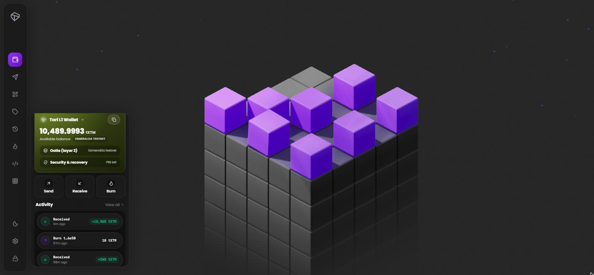
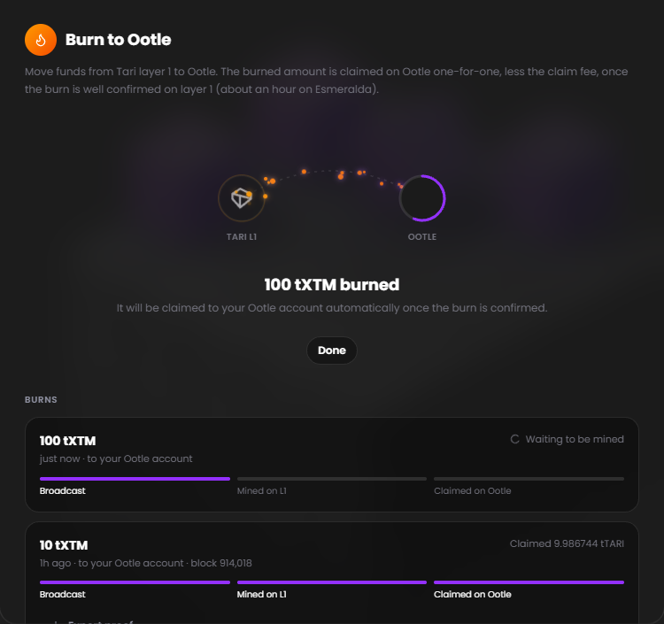
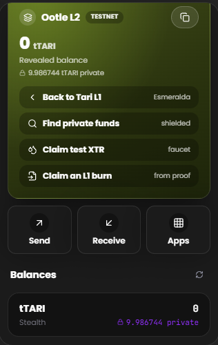

# Tari L1 Web Wallet

A self-custodial Minotari (Tari layer 1) wallet that runs entirely in the browser, with the
Ootle layer 2 account from the same recovery phrase built in. Keys are generated and every
transaction is built and signed locally, in WebAssembly; nothing secret leaves the page.

**Live:** [universe.tari.mw](https://universe.tari.mw)



## Feature comparison

Tari Universe is a desktop application built around mining, with a wallet included. This project is
wallet-first, browser-based, and adds the Ootle layer 2 account and dApp workflows described below.

| Feature | Tari L1 Web Wallet | Tari Universe (desktop) |
|---|---|---|
| Product shape | Self-custodial web wallet | Desktop application with wallet and mining |
| Installation | None: open the web app | Desktop app download and installation |
| Runtime | Browser-only; no wallet daemon, native wallet process, or local node | Native desktop application and local node |
| Key management | Keys generated and used locally in WebAssembly | Managed by the desktop wallet stack |
| Transaction signing | Build and sign locally in WebAssembly | Desktop wallet signing stack |
| Chain sync | Scans a public base-node query service with parallel web workers | Syncs its own node |
| MainNet | Yes | Yes |
| Esmeralda testnet | Yes; selectable during create or restore | Separate network build |
| L1 wallet | Yes | Yes |
| L1 receiving and sending | Yes | Yes |
| One-sided payments | Yes; dual-address payments keep the sender private by default | Not listed as a web-wallet feature |
| Sender disclosure | Opt-in reveal of the sender address | — |
| Sub-addresses | Payment IDs, labels, and incoming-payment attribution | — |
| Delayed transaction broadcast | Sign, save/export, and broadcast later from Activity | — |
| Signed transaction export | JSON export and re-broadcast from Activity | — |
| Enciphered backup export | Yes | — |
| Ootle layer 2 | Built in from the same recovery phrase | — |
| Ootle public and private sends | Yes | — |
| Ootle shield and unshield | Yes | — |
| Ootle private-payment discovery | Automatic scanning and rediscovery | — |
| Ootle fee selection | Private or transparent fee per transaction, including stealth fees | — |
| Ootle dApps/apps | Built-in Ootle app catalogue | — |
| L1 burn to Ootle | Burn on L1 and claim on Ootle automatically | — |
| Burn to another Ootle account | Export a claim proof for the recipient account | — |
| Import a burn proof | Claim a burn made elsewhere, including a console-wallet proof | — |
| dApp provider | `window.tari`, matching the Sapient extension API | — |
| dApp permissions | Connection, private-view, ownership-proof, and per-transaction approval | — |
| dApp catalogue | Install and explore dApps in an embedded cross-origin frame | — |
| Developer tools | Blake2b, Ristretto Schnorr, and Pedersen commitment tools | — |
| CPU mining | — | Yes |
| GPU mining | — | Yes |

### Burn to Ootle

Move funds from layer 1 to Ootle without the console wallet or a wallet daemon. The burn is signed
in the browser; once it is mined, the wallet fetches the kernel merkle proof and claims it into your
Ootle account as private TARI as soon as the Ootle validators accept it (about an hour on Esmeralda).
The claim fee is measured with a dry run rather than guessed, because a stealth-revealed fee is
never refunded.

- Burn to your own Ootle account (claimed automatically) or to any Ootle account's public key (the
  proof is exported for that account to claim).
- Claim a burn made elsewhere, such as a `minotari_console_wallet` proof file, from the Ootle side.
- MainNet burns are allowed but clearly marked as not claimable yet: Ootle does not run on MainNet.

 

### Ootle (layer 2)

The Ootle account derived from the same seed, on the Esmeralda testnet: public and private sends,
shield and unshield, rediscovering private funds, the testnet faucet, and a catalogue of Ootle apps.

### Also includes

- PIN lock with auto-lock; the seed is encrypted at rest with the PIN.
- 24-word recovery phrase compatible with the official Tari wallet (Tari CipherSeed), in any of
  Tari's languages, plus enciphered backup hex.
- Sub-addresses (payment ids), with incoming payments attributed to the sub-address they were paid to.
- One-sided payments that keep the sender private by default, with an opt-in to reveal your address.
- Sign now and broadcast later: signed transactions can be saved, exported as JSON and broadcast
  from Activity.
- Developer tools: Blake2b hashing, Ristretto Schnorr signatures and Pedersen commitments.

## Running it

```bash
npm install
npm run dev      # http://localhost:5173
npm run build    # production build into dist/
```

Chain reads go straight to the network's public base node query service (`rpc.tari.com`,
`rpc.esmeralda.tari.com`). Browsers may read it cross-origin but not POST to it, so broadcasts go
through a same-origin `/rpc/<network>/json_rpc` route: the Vite dev server proxies it, and
`vercel.json` holds the equivalent rewrites for a deployment. `server/` and `api/` hold an optional
MainNet gRPC bridge, used only as a fallback on MainNet.

The L1 transaction builder is `vendor/tari-l1-wasm` (the `tari_l1_wasm` crate); the Ootle account
comes from [`@chironbuilder/ootle-sdk`](https://www.npmjs.com/package/@chironbuilder/ootle-sdk).

## License

[CPAL-1.0](LICENSE) (Common Public Attribution License). Section 15 treats serving the software over
a network as distribution, so a deployment of this code, modified or not, must make its source
available. Exhibit B requires deployments to keep the attribution notice visible; the wallet shows
it at the bottom of Settings.

The third-party builds in `vendor/` keep their own licenses (BSD-3-Clause).
